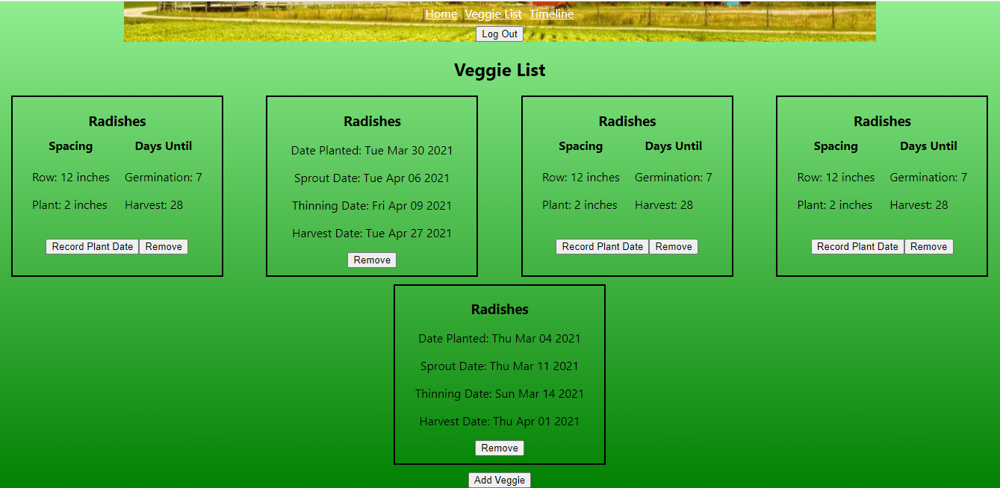

# Veggie Time
Live App: https://veggie-time.vercel.app/
Server Repository: https://github.com/Leojanas/veggie-time-api

This app was created with React in the front end, and uses a back end built with Node.js, Express, and PostgreSQL.

## Summary

This app assists user with scheduling and tracking activity in a vegetable garden. The user can create an account to create their own personal garden. They can then select the veggies that they want to grow, and the app gives information on plant spacing and time to germination and harvest. The user can then select their planting date, and the app uses that to generate estimated dates for germination, thinning, and harvesting. The user can also manually add events to their timeline to track tasks such as watering and weeding the garden.

## Screenshots
Home Screen

This shows the home screen, which gives users instructions on how to use the app. The nav links at the top use React Router to take the user to the other sections of the app.

Log In

This page allows the user to log in, and has a link to the singup form if the user does not have an account yet.

Veggie List

This page shows the user the veggies they currently have selected for their garden, and allows them to add new veggies, set plant dates, and remove veggies.

TImeline

This shows the user all of the events they have for their garden.  It can be viewed one day at a time or in full view which shows all events.  Users can mark events complete and add new events.
